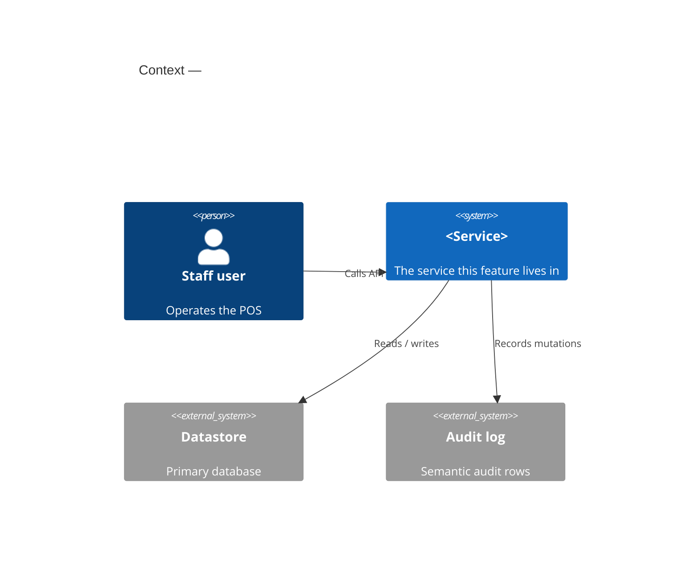
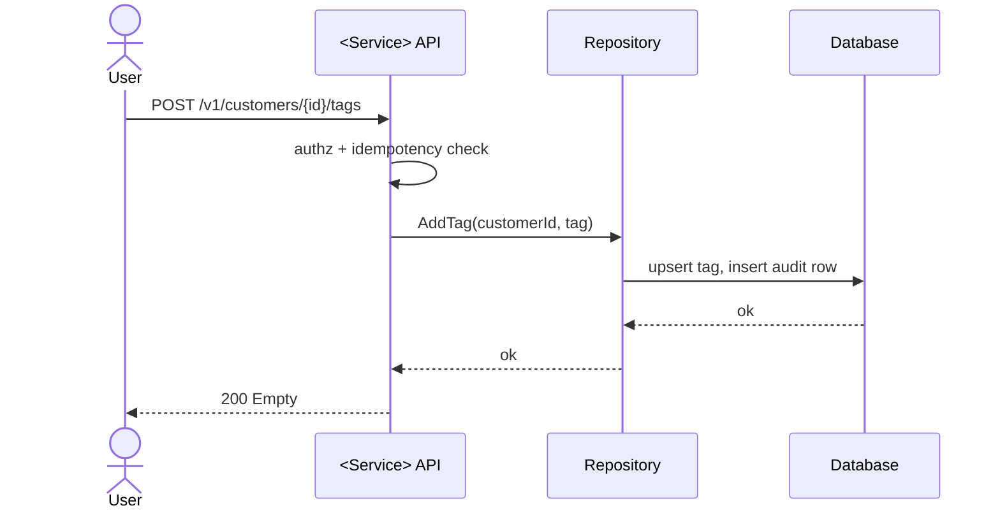

# Phase 1 — Documentation

Produce every design artifact before any code. This reference gives the doc
tree, the procedure, and a template for each document.

## Table of Contents

1. [Doc tree](#1-doc-tree)
2. [Procedure](#2-procedure)
3. [ADR — Architecture Decision Record](#3-adr--architecture-decision-record)
4. [PRD — Product Requirements Document](#4-prd--product-requirements-document)
5. [Diagrams](#5-diagrams)
6. [API definition](#6-api-definition)
7. [Anti-slop docs](#7-anti-slop-docs)
8. [Wiki](#8-wiki)

## 1. Doc tree

The skill creates (or extends) this layout in the target repo:

```
<repo>/
├── CONTEXT.md                       # domain glossary (ubiquitous language)
├── CONVENTIONS.md                   # guardrails: patterns to reuse, non-goals, anti-patterns
├── TEST-STRATEGY.md                 # what/how to test, prior-art test files
└── docs/
    ├── adr/NNNN-*.md                # Nygard 5-section ADRs
    ├── prd/<feature>.md             # PRD / requirements
    ├── diagrams/
    │   ├── context.mmd              # mermaid context diagram
    │   ├── sequence-<flow>.mmd      # mermaid sequence diagrams
    │   └── er.dbml                  # dbml ER diagram
    ├── api/<service>.proto          # proto projects (else <feature>-api.md markdown)
    ├── tasks/<feature>.md           # Phase 2 output (task DAG)
    └── wiki/                        # LLM Wiki — compounding synthesis layer
        ├── README.md                # schema: conventions + ingest/query/lint workflows
        ├── index.md                 # content catalog: every page, link, 1-line summary
        ├── log.md                   # append-only chronicle
        ├── overview.md              # evolving synthesis / thesis for the feature
        ├── entities/<name>.md       # entity pages
        └── concepts/<name>.md       # concept pages
```

If the repo already has `docs/adr/`, a `CONTEXT.md`, a proto directory, etc.,
**reuse the existing location and numbering** — do not create a parallel tree.

## 2. Procedure

1. **Scan the repo.** Language, stack, protobuf or not, existing doc layout,
   highest existing ADR number.
2. **Write `CONTEXT.md`** first if absent — the glossary pins vocabulary used by
   every later doc.
3. **Write the ADR(s)** for the decisions this feature forces.
4. **Write the PRD** for the feature.
5. **Draw the diagrams** — context, the sequence flows, the ER diagram.
6. **Write the API definition** — proto or markdown spec.
7. **Write `CONVENTIONS.md` and `TEST-STRATEGY.md`.**
8. **Ingest everything into the wiki** — see [wiki-pattern.md](wiki-pattern.md).
9. **Lint the wiki** — contradictions, orphans, missing cross-references.

Each document below is a complete template — fill it, do not abbreviate it.

## 3. ADR — Architecture Decision Record

Nygard classic, five sections. One file per decision, numbered sequentially:
`docs/adr/0007-use-mongodb-for-write-model.md`.

Write an ADR only when **all three** are true: the decision is hard to reverse,
it would surprise a future reader without context, and a real trade-off existed.
Routine choices do not get an ADR.

```markdown
# NNNN. <Short title of the decision>

## Status

Proposed | Accepted | Deprecated | Superseded by ADR-NNNN

## Context

Why this decision is needed. The forces at play: requirements, constraints,
existing system facts. State the problem, not the answer. 1–2 paragraphs.

## Decision

What we decided, stated actively: "We will ...". One paragraph. If alternatives
were genuinely considered, name them and say in one line why each lost.

## Consequences

The resulting context after the decision. What becomes easier, what becomes
harder, what new constraints or follow-up work appear. Include the negative
consequences honestly — an ADR with only upsides is not trustworthy.
```

## 4. PRD — Product Requirements Document

One file per feature: `docs/prd/<feature>.md`.

```markdown
# PRD: <Feature Name>

## Problem

The problem from the user's perspective. What hurts today, who feels it.

## Goals

Specific, measurable objectives.
- <goal 1>
- <goal 2>

## User Stories

### US-001: <Title>
As a <role>, I want <capability> so that <benefit>.

Acceptance criteria — verifiable, with concrete values:
- [ ] Given <context>, when <action>, then <observable result>
- [ ] Given <edge case>, when <action>, then <handling>

### US-002: <Title>
...

## Functional Requirements

- FR-1: <requirement>
- FR-2: <requirement>

## Non-Goals

What this feature explicitly does NOT include. This bounds scope and prevents
the implementation phase from drifting.

## Open Questions

Anything unresolved. If empty, say "None".
```

Acceptance criteria must be checkable. "Works correctly" is banned. "Returns 409
when `lock_version` is stale" is good.

## 5. Diagrams

Three diagram types, stored in `docs/diagrams/`. Context and sequence use
**mermaid**; the ER diagram uses **dbml**.

### Context diagram — `context.mmd` (mermaid)

Shows the system, its users, and external systems it talks to.



If `C4Context` is too heavy for the case, a `flowchart LR` of boxes and arrows
is acceptable — keep it readable.

### Sequence diagram — `sequence-<flow>.mmd` (mermaid)

One file per significant flow (e.g. `sequence-add-tag.mmd`).



### ER diagram — `er.dbml` (dbml)

```dbml
Table customer_tag {
  customer_id varchar [not null]
  tag varchar [not null]
  business_id varchar [not null]
  created_at timestamp
  Indexes {
    (customer_id, tag) [pk]
    business_id
  }
}

Table segment {
  id varchar [pk]
  business_id varchar [not null]
  name varchar [not null]
  kind varchar [not null, note: 'STATIC | RULE']
  status varchar [not null, note: 'ACTIVE | ARCHIVED']
  lock_version bigint [not null, default: 0]
}

Ref: customer_tag.business_id > segment.business_id
```

## 6. API definition

**Detect first.** If the repo contains `.proto` files or a `buf.yaml` /
`buf.gen.yaml`, the project uses protobuf — write the `.proto` directly. See
[protobuf-conventions.md](protobuf-conventions.md) for the full canonical style.

If the project does **not** use protobuf, write a human-readable markdown API
spec at `docs/api/<feature>-api.md`. The template is in
[protobuf-conventions.md](protobuf-conventions.md#markdown-api-spec-fallback).

Never invent an API style the repo does not already use.

## 7. Anti-slop docs

These three documents exist to keep the autonomous implementation phase from
drifting. Produce all three.

### `CONTEXT.md` — domain glossary

Pins the ubiquitous language. Naming drift dies here.

```markdown
# <Context Name>

<1–2 sentence description of this bounded context.>

## Language

**<Term>**: <concise definition, one sentence>.
_Avoid_: <alternative terms not to use for this concept>.

**<Term>**: <definition>.

## Relationships

- A **<Term>** produces one or more **<Term>**.
- A **<Term>** belongs to exactly one **<Term>**.

## Flagged ambiguities

- "<word>" was used to mean both X and Y — resolved: <resolution>.
```

### `CONVENTIONS.md` — guardrails

Stops scope creep and pattern reinvention.

```markdown
# Conventions — <feature/area>

## Patterns to follow
- <pattern>: see `path/to/file.ext:L10-L40` — <why>.
- Error handling: <the repo's approach>.

## Libraries / helpers to reuse
- <lib or helper> for <purpose>. Do not hand-roll.

## Non-goals
- <out-of-scope item>.

## Anti-patterns — do not do these
- <anti-pattern> — <what to do instead>.
```

### `TEST-STRATEGY.md`

```markdown
# Test Strategy — <feature>

## What to test
- <behavior> — <test type: e2e | integration | unit>.

## What makes a good test here
- <repo-specific guidance: assert observable behavior, reconcile DB, etc.>.

## Prior-art test files to mirror
- `path/to/existing_test.ext` — <why it is a good model>.

## E2E harness
- Present: <yes/no>. If yes: <how to run, where tests live>.
```

## 8. Wiki

Every artifact produced above is ingested into a compounding LLM wiki under
`docs/wiki/`. The wiki is the synthesis layer the later phases read to stay
grounded. Its structure, the `index.md` / `log.md` navigation files, and the
ingest / query / lint operations are specified in
[wiki-pattern.md](wiki-pattern.md). Do this step last in Phase 1, after all
other docs exist, then run a lint pass.
